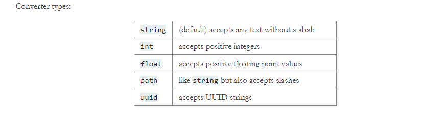

## Debug Mode
`flask run`命令其实只是启动development server，通过启用debug模式，如果代码更改，服务器将自动重新加载，并且如果在请求期间发生错误，则会在浏览器中显示交互式调试器。

要启动debug模式，使用`--debug`选项
```shell
$ flask --app hello run --debug
 * Serving Flask app 'hello'
 * Debug mode: on
 * Running on http://127.0.0.1:5000 (Press CTRL+C to quit)
 * Restarting with stat
 * Debugger is active!
 * Debugger PIN: nnn-nnn-nnn
```
## HTML转义
当返回HTML的时候（Flask的默认响应类型），为了防止注入攻击，所有用户提交的值，在输出渲染之前，都得被转义。如果使用
Jinja，渲染的HTML模板会自动执行此操作。  
escape() 可以手动转义。因为保持简洁的原 因，在多数示例中它被省略了，但您应该始终留心处理不可信的数据。
```python
from markupsafe import escape

@app.route("/<name>")
def hello(name):
    return f"Hello, {escape(name)}!"
```
## Routing 路由
使用route()注解来将function绑定到URL
```python
@app.route('/')
def index():
    return 'Index Page'

@app.route('/hello')
def hello():
    return 'Hello, World'
```
### 变量规则
+ 使用`<variable_name>`来获取url中的变量
+ 使用`<converter:variable_name>`来获取变量并转换类型
```python
from markupsafe import escape

@app.route('/user/<username>')
def show_user_profile(username):
    # show the user profile for that user
    return f'User {escape(username)}'

@app.route('/post/<int:post_id>')
def show_post(post_id):
    # show the post with the given id, the id is an integer
    return f'Post {post_id}'

@app.route('/path/<path:subpath>')
def show_subpath(subpath):
    # show the subpath after /path/
    return f'Subpath {escape(subpath)}'
```

### Unique URLs和重定向行为
下面这两个规则因为末尾是否有斜杠所以使用上有所区别
```python
@app.route('/projects/')
def projects():
    return 'The project page'

@app.route('/about')
def about():
    return 'The about page'
```
`projects`的结尾有个斜杠，类似于文件系统中的文件夹的概念，如果访问`/projects`而不加后面的斜杠，Flask会自动重定向到`/projects/

`about`的结尾没有斜杠，类似于文件系统中的一个路径名或者一个文件。如果访问`/about/`多了个斜杠，将会产生一个404 “Not Found“
这有助于使这些资源的 URL 保持唯一，这有助于搜索引擎避免对同一页面进行两次索引。

### URL Building
`url_for`函数用来构建指定函数的URL，第一个参数传的是函数名。之后可以跟任意个关键字参数，每个关键字参数对应URL中的变量。位置变量将添加到
URL中作为查询参数

为啥我们不把URL写死在模板中，而是要使用反转函数`url_for()`来动态构建呢：
1. 反向构建的描述性更好
2. 可以只在一个地方修改URL，不用到处去找
3. URL 创建会为您处理特殊字符的转义，比较直观
4. 生产的路径总是绝对路径，可以避免相对路径产生副作用。
5. 如果您的应用是放在 URL 根路径之外的地方（如在 /myapplication 中，不在 / 中）， url_for() 会为您妥善处理。

### HTTP请求方法
使用同一个URL的时候，应用可以使用多钟HTTP请求方式。默认情况下，route只响应`GET`请求，可以使用route()注解里面的`methods`参数
来处理不同的HTTP请求。
```python
from flask import request

@app.route('/login', methods=['GET', 'POST'])
def login():
    if request.method == 'POST':
        return do_the_login()
    else:
        return show_the_login_form()
```
上面的示例将路由的所有方法保留在一个函数中，如果每个部分都使用一些公共数据，这将很有用。

还可以将不同方法的视图分成不同的函数。 Flask 为每个常见的 HTTP 方法提供了一种快捷方式，用于使用 get()、post() 等来装饰此类路由。

```python
@app.get('/login')
def login_get():
    return show_the_login_form()

@app.post('/login')
def login_post():
    return do_the_login()
```
如果存在 GET，Flask 会自动添加对 HEAD 方法的支持，并根据 HTTP RFC 处理 HEAD 请求。同样，OPTIONS 会自动为您实现。

